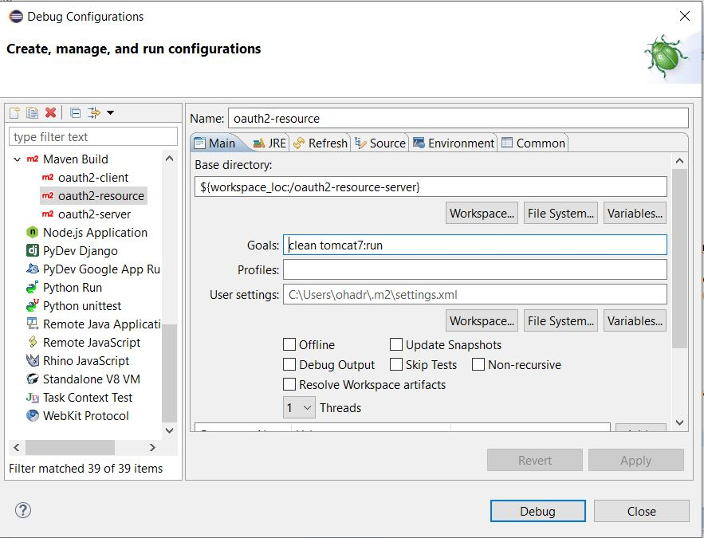

oAuth2-sample   [](https://travis-ci.org/OhadR/oAuth2-sample)
=============

This project is a oAuth2 POC, consists of all 3 oAuth parties: the authentication server, a resource server, and a client app.
Each party is represented by its own WAR.

## 23-02-2016: Spring Versions Updated

On 23-02-2016, we have updated Spring versions to the newest!

* Spring Security: 4.0.3.RELEASE
* Spring: 4.2.4.RELEASE
* Spring Security oAuth: 2.0.9.RELEASE

## How to Run 1: Deploy all components on the same Tomcat

* Deploy all 3 WARs on a servlet container, e.g. Tomcat.
* Browse http://localhost:8080/oauth2-client/hello. The client needs a login by itself: admin/admin (Spring Security expects your client web-app to have its own credentials).
* client app tries to call the resource-server url http://localhost:8080/oauth2-resource-server/welcome
* This will redirect to oauth2.0 authentication server. Login to authentication-server, currently it is from mem: demo@ohadr.com/demo. it can be configured to read from a DB.
* client should access the resource server using the access-token, and print a message.
* **NOTE that you will have to change the ports' configurations to 8080 in  oauth2-client/.../client.properties.**

## How to Run 2: tomcat7-maven-plugin

from command line, use the following command:
    
    mvn clean tomcat7:run
   
each component is configured to use a different port:
* resource-server on port 8094, 
* auth-server 8091, 
* client 8092.

* Browse http://localhost:8092/oauth2-client/hello. The client needs a login by itself: admin/admin (Spring Security expects your client web-app to have its own credentials).
* client app tries to call the resource-server url http://localhost:8094/oauth2-resource-server/welcome
* This will redirect to oauth2.0 authentication server. Login to authentication-server, for simplicity it is in-mem: demo@ohadr.com/demo.
* client should access the resource server using the access-token, and print a message.

## How to Run 3: debug from eclipse

Since each component is configured to use a different port (see above), it is easy to run all 3 components from eclipse. Below is the configuration (note the 3 configs):




for more info, See this README: https://gitlab.com/OhadR/activemq-spring-sandbox#debug-within-eclipse


Project Components
==================

JAR: auth-common
------------
common code for authentication.  You can find it also in this project,
and also it is available in Maven repository:

```xml
<dependency>
  <groupId>com.ohadr</groupId>
  <artifactId>auth-common</artifactId>
  <version>1.1.3</version>
</dependency>
```

Note the version - make sure you use the latest.

KeyStore things to know:
========================
1. a keystore may be created, both for SSL and for signing the tokens. If, for simplicity, the user wants to skip fighting keystore, he should set the flag `com.ohadr.oauth2.token.cryptoEnabled=false`
2. its alias and password should be updated in the prop file as well as in the tomcat's server.xml
3. algorithm should be DSA (because in the access-token signature my code expects it to be "SHA1withDSA"
4. if you want to work with "localhost", you should make the name "localhost": 
5. http://stackoverflow.com/questions/6908948/java-sun-security-provider-certpath-suncertpathbuilderexception-unable-to-find/12146838#12146838

creating a token using Java's keytool:
keytool.exe -genkeypair -alias <alias> -keypass <key-password> -keyalg DSA -keystore <file-name> -storepass <ks-password> -storetype JCEKS -v


Java Encryption:
================
Cipher cipher = Cipher.getInstance("AES/ECB/PKCS5Padding");  
SecretKeySpec secretKey = new SecretKeySpec(key, "AES");
cipher.init(Cipher.ENCRYPT_MODE, secretKey);
String encryptedString = Base64.encodeBase64String(cipher.doFinal(strToEncrypt.getBytes()));
return encryptedString;

http://techie-experience.blogspot.co.il/2012/10/encryption-and-decryption-using-aes.html
http://docs.oracle.com/javase/7/docs/api/javax/crypto/Cipher.html#init(int, java.security.Key)


