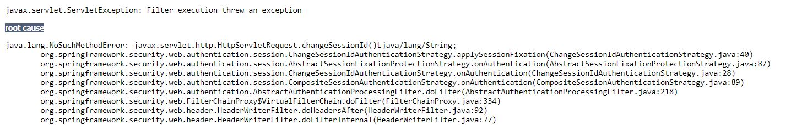
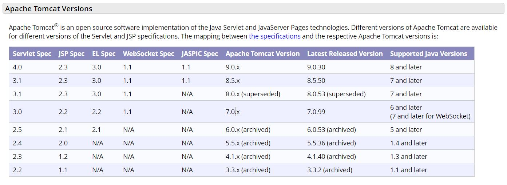
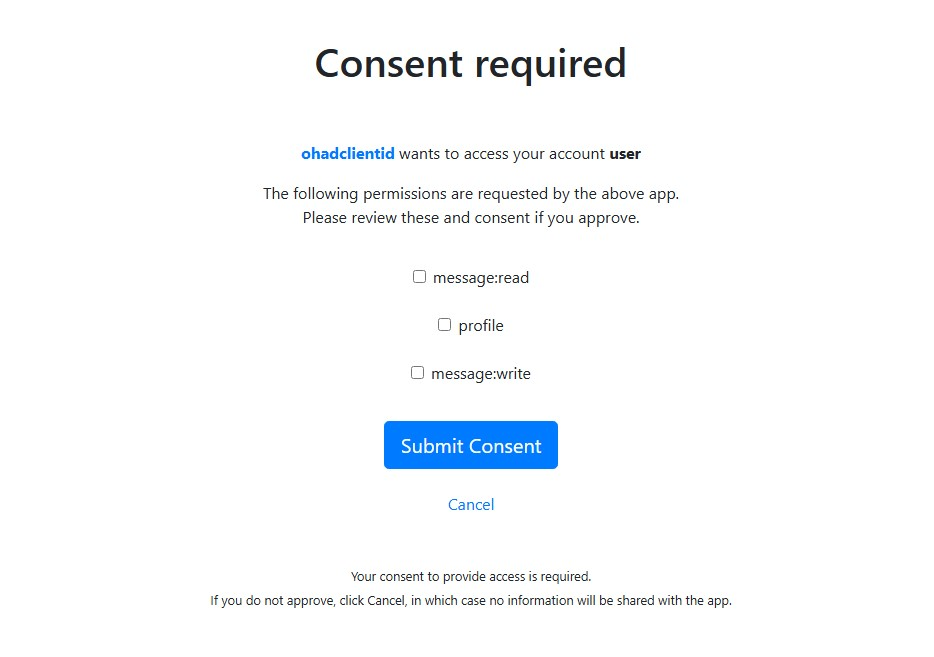
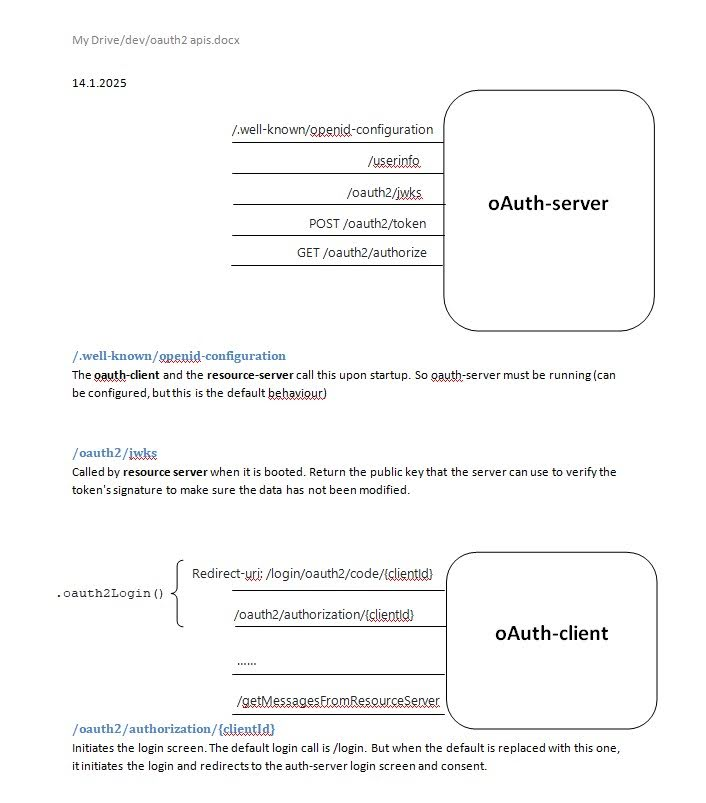

oAuth2-sample   [](https://travis-ci.org/OhadR/oAuth2-sample)
=============

This project is a oAuth2 POC, consists of all 3 oAuth parties: the authentication server, a resource server, and a client app.
Each party is represented by its own WAR.

## 01-2025: Spring Versions Updated; Spring-Boot 3

    mvn dependency:tree

* Spring Boot: 3.4.1
* Spring: 6.2.1
* Spring Security: 6.4.2

https://spring.io/guides/tutorials/spring-boot-oauth2#_social_login_click

https://stackoverflow.com/questions/74447118/csrf-protection-not-working-with-spring-security-6

https://docs.spring.io/spring-security/reference/servlet/exploits/csrf.html#csrf-integration-javascript

https://docs.spring.io/spring-security/reference/servlet/oauth2/client/authorization-grants.html

https://www.baeldung.com/spring-security-oauth-auth-server

https://spring.io/blog/2024/10/28/restclient-support-for-oauth2-in-spring-security-6-4

resource server:

https://docs.spring.io/spring-security/reference/servlet/oauth2/resource-server/jwt.html

### notes

upon startup, the auth-cli calls the auth-server  /.well-known/openid-configuration, to verify the issuer.
(same for resource-server).
if the issuer in the cli (property `provider.ohads.issuer-uri`) is different than the server's (property `..authorizationserver.issuer`), an error 
is thrown:

    java.lang.IllegalStateException: The Issuer "http://auth-server:9000" provided in the configuration metadata did not match the requested issuer "http://localhost:9000"

the `OidcProviderConfigurationEndpointFilter` handles it.

"To see the OpenID configuration document for an application's common authority, navigate to https://login.microsoftonline.com/common/v2.0/.well-known/openid-configuration"

Next, there is a (default) call to GET `/oauth2/authorize?response_type=code&client_id=ohadclientid&...`
unless the client properties defined otherwise (in `provider.ohads.authorization-uri`).

The `OAuth2AuthorizationEndpointFilter` handles it.

it also checks the client-id in the request. if there is a mismatch, exception is thrown:

```
2025-01-09T12:01:33.158+02:00 TRACE 8272 --- [nio-9000-exec-2] .s.a.w.OAuth2AuthorizationEndpointFilter : Authorization request failed: [invalid_request] OAuth 2.0 Parameter: client_id

org.springframework.security.oauth2.server.authorization.authentication.OAuth2AuthorizationCodeRequestAuthenticationException: OAuth 2.0 Parameter: client_id
```

* The `OAuth2AuthorizationEndpointFilter` has several providers that it activates. For example, the `OAuth2AuthorizationCodeRequestAuthenticationProvider`
checks the scope that the client requests. Upon mismatch:

```declarative
2025-01-09T12:16:37.842+02:00 DEBUG 12432 --- [nio-9000-exec-2] zationCodeRequestAuthenticationValidator : Invalid request: requested scope is not allowed for registered client 'articles-client'
2025-01-09T12:16:37.847+02:00 DEBUG 12432 --- [nio-9000-exec-2] .s.a.DefaultAuthenticationEventPublisher : No event was found for the exception org.springframework.security.oauth2.server.authorization.authentication.OAuth2AuthorizationCodeRequestAuthenticationException
2025-01-09T12:16:37.848+02:00 TRACE 12432 --- [nio-9000-exec-2] .s.a.w.OAuth2AuthorizationEndpointFilter : Authorization request failed: [invalid_scope] OAuth 2.0 Parameter: scope

org.springframework.security.oauth2.server.authorization.authentication.OAuth2AuthorizationCodeRequestAuthenticationException: OAuth 2.0 Parameter: scope
```

* cannot run all parties on localhost, because i get `OAuth2AuthenticationException: [authorization_request_not_found]`:

https://github.com/spring-projects/spring-security/issues/5946

https://stackoverflow.com/questions/50908023/using-spring-security-oauth-using-a-custom-oauth-provider-i-get-authorization


* in the oauth-server, the property `client-secret: "{noop}ohadclientsecret"`is not secured, but the prefix is a must o/w spring
throws error:
```
Given that there is no default password encoder configured, each password must have a password encoding prefix. Please 
either prefix this password with '{noop}' or set a default password encoder in `DelegatingPasswordEncoder`
```

### How to Run (Spring Boot)

Running these component is different than in older versions. Then, each component was a WAR. But with Spring Boot all components
are JARs, and each component easily with:

    mvn clean spring-boot:run

Note that the auth-server must be running before the auth-cli, as the cli calls `/.well-known/openid-configuration` (see above)

Browse http://localhost:8080. The user can choose which auth-server he wants to login with: GitHub, Google, or "ohads" which 
is the local implementation of auth-server with Spring Boot. login with user/password.

### How to debug from IntelliJ

https://stackoverflow.com/questions/75483956/debug-spring-boot-3-in-intellij-community

in the terminal: `mvn spring-boot:run -f .\pom.xml`


## 02-2020: Spring Versions Updated

On 02-2020, Spring versions were updated:

* Spring: 5.2.3.RELEASE
* Spring Security: 5.2.2.RELEASE
* Spring Security oAuth: 2.0.16.RELEASE

### Spring security 5: PasswordEncoder

Mechanism of password encoder was changed in Spring-Security 5. I had to adjust configuration.

### Spring security and Session Fixation Protection

https://www.baeldung.com/spring-security-session
https://docs.spring.io/spring-security/site/docs/current/reference/html5/#ns-session-fixation. 

After successful login I hit `NoSuchMethodError: javax.servlet.http.HttpServletRequest.changeSessionId()`. It happens because Spring's session-fixation-protection calls (see stack below) to servlet API to 3.1's `HttpServletRequest.changeSessionId`.
One option is to upgrade to servlet API to 3.1, but then I will have to upgrade to tomcat-8 (http://tomcat.apache.org/whichversion.html). Thus the components should be deployed on tomcat-8. More simple solution is to disable the session-fixation-protection for this demo.





Trying to migrate tomcat7-maven-plugin to tomcat8-maven-plugin is another story.


## 23-02-2016: Spring Versions Updated

On 23-02-2016, Spring versions were updated:

* Spring: 4.2.4.RELEASE
* Spring Security: 4.0.3.RELEASE
* Spring Security oAuth: 2.0.9.RELEASE


### How to Run 1: Deploy all components on the same Tomcat

* Deploy all 3 WARs on a servlet container, e.g. Tomcat.
* Browse http://localhost:8080/oauth2-client/hello. The client needs a login by itself: admin/admin (Spring Security expects your client web-app to have its own credentials).
* client app tries to call the resource-server url http://localhost:8080/oauth2-resource-server/welcome
* This will redirect to oauth2.0 authentication server. Login to authentication-server, currently it is from mem: demo@ohadr.com/demo. it can be configured to read from a DB.
* client should access the resource server using the access-token, and print a message.
* **NOTE that you will have to change the ports' configurations to 8080 in  oauth2-client/.../client.properties.**

### How to Run 2: tomcat7-maven-plugin

from command line, use the following command:
    
    mvn clean tomcat7:run
   
each component is configured to use a different port:
* resource-server on port 8094, 
* auth-server 8091, 
* client 8092.

* Browse http://localhost:8092/oauth2-client/hello. The client needs a login by itself: admin/admin (Spring Security expects your client web-app to have its own credentials).
* client app tries to call the resource-server url http://localhost:8094/oauth2-resource-server/welcome
* This will redirect to oauth2.0 authentication server. Login to authentication-server, for simplicity it is in-mem: demo@ohadr.com/demo.
* client should access the resource server using the access-token, and print a message.

### How to Run 3: debug from eclipse

Since each component is configured to use a different port (see above), it is easy to run all 3 components from eclipse. Below is the configuration (note the 3 configs):


for more info, See this README: https://gitlab.com/OhadR/activemq-spring-sandbox#debug-within-eclipse


# JAR: auth-common

common code for authentication.  You can find it also in this project,
and also it is available in Maven repository:

```xml
<dependency>
  <groupId>com.ohadr</groupId>
  <artifactId>auth-common</artifactId>
  <version>1.1.3</version>
</dependency>
```

Note the version - make sure you use the latest.

KeyStore things to know:
========================
1. a keystore may be created, both for SSL and for signing the tokens. If, for simplicity, the user wants to skip fighting keystore, he should set the flag `com.ohadr.oauth2.token.cryptoEnabled=false`
2. its alias and password should be updated in the prop file as well as in the tomcat's server.xml
3. algorithm should be DSA (because in the access-token signature my code expects it to be "SHA1withDSA"
4. if you want to work with "localhost", you should make the name "localhost": 
5. http://stackoverflow.com/questions/6908948/java-sun-security-provider-certpath-suncertpathbuilderexception-unable-to-find/12146838#12146838

creating a token using Java's keytool:
keytool.exe -genkeypair -alias <alias> -keypass <key-password> -keyalg DSA -keystore <file-name> -storepass <ks-password> -storetype JCEKS -v


## Java Encryption:

```
Cipher cipher = Cipher.getInstance("AES/ECB/PKCS5Padding");  
SecretKeySpec secretKey = new SecretKeySpec(key, "AES");
cipher.init(Cipher.ENCRYPT_MODE, secretKey);
String encryptedString = Base64.encodeBase64String(cipher.doFinal(strToEncrypt.getBytes()));
return encryptedString;
```
http://techie-experience.blogspot.co.il/2012/10/encryption-and-decryption-using-aes.html
http://docs.oracle.com/javase/7/docs/api/javax/crypto/Cipher.html#init(int, java.security.Key)

# oAuth , Spring 6

## Authentication-Server Security Filters

```
DisableEncodeUrlFilter (1/29)
WebAsyncManagerIntegrationFilter (2/29)
SecurityContextHolderFilter (3/29)
AuthorizationServerContextFilter (4/29)
HeaderWriterFilter (5/29)
CsrfFilter (6/29)
OidcLogoutEndpointFilter (7/29)
LogoutFilter (8/29)
OAuth2AuthorizationServerMetadataEndpointFilter (9/29)
OAuth2AuthorizationEndpointFilter (10/29) ****> responds to GET /oauth2/authorize. 20 more filters: OAuth2AuthorizationCodeRequestAuthenticationProvider and more...
OAuth2DeviceVerificationEndpointFilter (11/29)
OidcProviderConfigurationEndpointFilter (12/29) ---> responds to /.well-known/openid-configuration
NimbusJwkSetEndpointFilter (13/29)              ---> responds to GET /oauth2/jwks
OAuth2ClientAuthenticationFilter (14/29)  ****> responds to POST /oauth2/token. 20 more filters: JwtClientAssertionAuthenticationProvider, X509ClientCertificateAuthenticationProvider, ClientSecretAuthenticationProvider and more
UsernamePasswordAuthenticationFilter (15/29)
DefaultResourcesFilter (16/29)
DefaultLoginPageGeneratingFilter (17/29)        --> generates the login page
DefaultLogoutPageGeneratingFilter (18/29)
BearerTokenAuthenticationFilter (19/29)         ... JwtAuthenticationProvider
RequestCacheAwareFilter (20/29)
SecurityContextHolderAwareRequestFilter (21/29)
AnonymousAuthenticationFilter (22/29)
ExceptionTranslationFilter (23/29)
AuthorizationFilter (24/29)
OAuth2TokenEndpointFilter (25/29) (authorizing POST /oauth2/token. Authenticating request with OAuth2AuthorizationCodeAuthenticationProvider)
OAuth2TokenIntrospectionEndpointFilter (26/29)
OAuth2TokenRevocationEndpointFilter (27/29)
OAuth2DeviceAuthorizationEndpointFilter (28/29)
OidcUserInfoEndpointFilter (29/29)              ---> responds to GET /userinfo

```


## Resource-Server Security Filters


```
DisableEncodeUrlFilter (1/16)
WebAsyncManagerIntegrationFilter (2/16)
SecurityContextHolderFilter (3/16)
HeaderWriterFilter (4/16)
CsrfFilter (5/16)
LogoutFilter (6/16)
UsernamePasswordAuthenticationFilter (7/16)
DefaultResourcesFilter (8/16)
DefaultLoginPageGeneratingFilter (9/16) --> generates login page upon `/login` call
DefaultLogoutPageGeneratingFilter (10/16)
BasicAuthenticationFilter (11/16)
RequestCacheAwareFilter (12/16)
SecurityContextHolderAwareRequestFilter (13/16)
AnonymousAuthenticationFilter (14/16)
ExceptionTranslationFilter (15/16)
AuthorizationFilter (16/16)
```

## oAuth-client filters

```
... same as all ...
OAuth2AuthorizationRequestRedirectFilter (7/15) --> responds to GET oauth2/authorization/{registrationId} /and redirects to auth-server/oauth2/authorize?...
OAuth2AuthorizationRequestRedirectFilter (8/15 another one!! )
OAuth2LoginAuthenticationFilter (9/15) --> responds to GET /login/oauth2/code/ohads?..., and runs another chain:
```

the chain of `OAuth2LoginAuthenticationFilter`:
OAuth2LoginAuthenticationProvider
OidcAuthorizationCodeAuthenticationProvider


### `OAuth2AuthorizationCodeAuthenticationProvider`

retrieves registered client;
retrieves authorization with authorization code
validates token request params
generates access token
generates refresh token
save authorization


## The Flow: calls to oauth-server

* upon startup of the client, the client calls:

`GET /.well-known/openid-configuration`. (managed by `OidcProviderConfigurationEndpointFilter`).

* on "clean" env, when the client starts the login flow, the client first calls:
`GET /oauth2/authorize`. in the logs we see "login success for user: anonymousUser" and `AuthorizationFilter` throws Access 
Denied. This triggers the login flow.
* then there is a call `GET /login` (`DefaultLoginPageGeneratingFilter`)
* then the user (resource owner) enters his details and submit, so there is a call `POST /login` (`UsernamePasswordAuthenticationFilter`)
* then there is a call again to `GET /oauth2/authorize` and this time `OAuth2AuthorizationEndpointFilter` approves. It 
redirects to the **redirect-uri**.
* then, the client calls to `POST /oauth2/token`. (`OAuth2ClientAuthenticationFilter`).
* i see another call then to `GET /oauth2/jwks`. (handled by `NimbusJwkSetEndpointFilter`).
* and last, a call to `GET /userinfo`. (handled by the last filter in the chain, `OidcUserInfoEndpointFilter`)

## Spring's default consent screen

note: in auth-server yaml file, set: 

    require-authorization-consent: true




### oauth APIs




